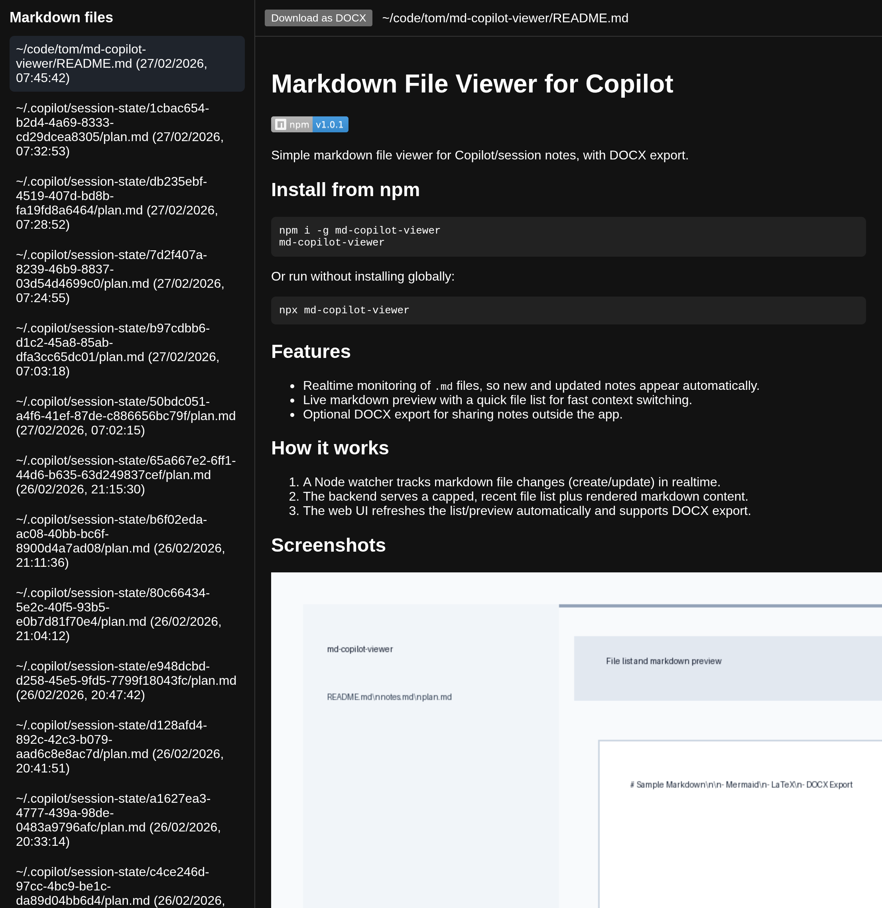
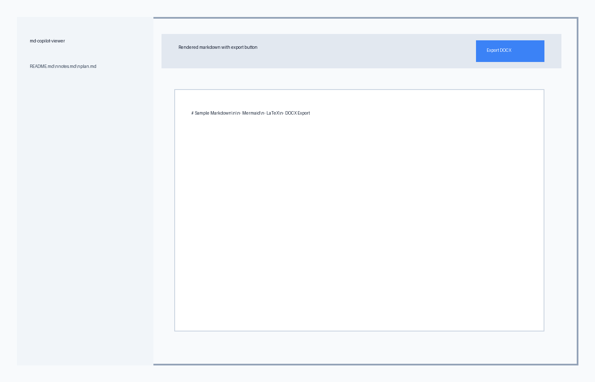

# Markdown File Viewer for Copilot
Simple markdown file viewer for Copilot/session notes, with DOCX export.

## Features

- Realtime monitoring of `.md` files, so new and updated notes appear automatically.
- Live markdown preview with a quick file list for fast context switching.
- Optional DOCX export for sharing notes outside the app.

## How it works

1. A Node watcher tracks markdown file changes (create/update) in realtime.
2. The backend serves a capped, recent file list plus rendered markdown content.
3. The web UI refreshes the list/preview automatically and supports DOCX export.

## Screenshots




## Run

```bash
npm install
cp .env.template .env
npm run dev
```

`npm run dev` uses `PORT` from `.env` (default `3000`), so open:
- `http://localhost:3000` (default), or
- `http://localhost:<your PORT value>`

## `.env` config

`.env.template` includes:

```env
PORT=3000
LOAD_EXISTING_MD=true
EXCLUDE_PATTERN='"checkpoints/index.md"'
FILE_MAX_LIMIT=200
```

- `PORT`  
  Port used by `npm run dev` and `npm start` (default `3000`).
- `LOAD_EXISTING_MD`  
  - `true`: load markdown files that already exist when the app starts.  
  - `false`: only watch new markdown files created after startup.
- `EXCLUDE_PATTERN`  
  Comma-separated path substrings to ignore.  
  Example: `"checkpoints/index.md","tmp/","node_modules/"`
- `FILE_MAX_LIMIT`  
  Maximum number of most recently updated markdown files returned to the frontend (default `200`).

## API endpoints

- `GET /api/files`  
  Returns recent markdown files (max `FILE_MAX_LIMIT`) with `id`, display `path`, and `mtimeMs`.
- `GET /api/files/:id`  
  Returns one file as `{ path, markdown, html }`.
- `GET /api/files/:id/docx`  
  Downloads the selected markdown file as `.docx`.
