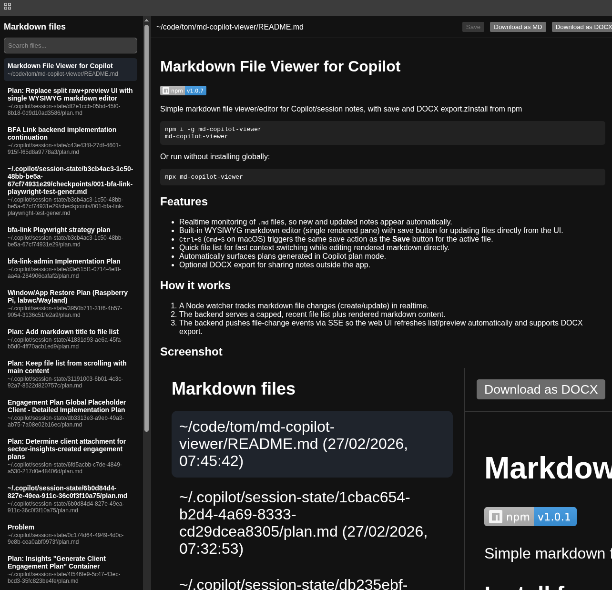

# Markdown File Viewer for Copilot

[](https://www.npmjs.com/package/md-copilot-viewer)

Simple markdown file viewer/editor for Copilot/session notes, with save and DOCX export.zInstall from npm

```bash
npm i -g md-copilot-viewer
md-copilot-viewer
```

Or run without installing globally:

```bash
npx md-copilot-viewer
```

## Features

*   Realtime monitoring of `.md` files, so new and updated notes appear automatically.
*   Built-in WYSIWYG markdown editor (single rendered pane) with save button for updating files directly from the UI.
*   `Ctrl+S` (`Cmd+S` on macOS) triggers the same save action as the **Save** button for the active file.
*   Quick file list for fast context switching while editing rendered markdown directly, showing both detected title and file path.
*   Automatically surfaces plans generated in Copilot plan mode.
*   Optional DOCX export for sharing notes outside the app.

## How it works

1.  A Node watcher tracks markdown file changes (create/update) in realtime.
2.  The backend serves a capped, recent file list plus rendered markdown content.
3.  The backend pushes file-change events via SSE so the web UI refreshes list/preview automatically and supports DOCX export.

## Screenshot



## Run

```bash
npm install
npm run dev
```

On first start, the app creates `.env-md-copilot-viewer` from `.env.template` if it does not exist.

`npm run dev` uses `PORT` from `.env-md-copilot-viewer` (default `3011`), so open:

*   `http://localhost:3011` (default), or
*   `http://localhost:<your PORT value>`

## `.env-md-copilot-viewer` config

`.env.template` includes:

```env
PORT=3011
AUTO_INCREMENT_PORT=true
LOAD_EXISTING_MD=true
EXCLUDE_PATTERN='"checkpoints/index.md"'
FILE_MAX_LIMIT=20
```

*   `PORT`  
    Port used by `npm run dev` and `npm start` (default `3011`).
*   `AUTO_INCREMENT_PORT`
    *   `true` (default): if `PORT` is already in use, increment until a free port is found.
    *   `false`: fail startup when `PORT` is already in use.
*   `LOAD_EXISTING_MD`
    *   `true`: load markdown files that already exist when the app starts.
    *   `false`: only watch new markdown files created after startup.
*   `EXCLUDE_PATTERN`  
    Comma-separated path substrings to ignore.  
    Example: `"checkpoints/index.md","tmp/","node_modules/"`
*   `FILE_MAX_LIMIT`  
    Maximum number of most recently updated markdown files returned to the frontend (default `20`).
    Keep this value modest to avoid unnecessary system load.

## API endpoints

*   `GET /api/files`  
    Returns recent markdown files (max `FILE_MAX_LIMIT`) with `id`, display `path`, `title`, and `mtimeMs`.  
    `title` is the first line without `#` when the first line starts with `#` ; otherwise an empty string.
*   `GET /api/files/:id`  
    Returns one file as `{ path, markdown, html }`.
*   `PUT /api/files/:id`  
    Saves markdown content from `{ markdown, baseMarkdown? }` and returns `{ path, markdown, html }`. If `baseMarkdown` is provided and the file changed on disk meanwhile, returns `409` with latest `{ path, markdown, html }` so the UI can reload theirs or keep mine.
*   `GET /api/files/:id/docx`  
    Downloads the selected markdown file as `.docx`.
*   `GET /api/changes`  
    Server-Sent Events stream that notifies the web app when markdown files change.
