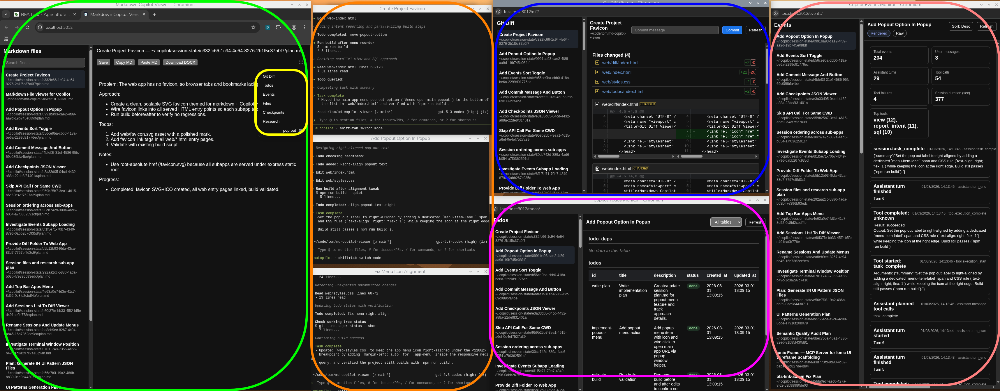

# Copilot Agent HQ for Vibe Engineering
[](https://www.npmjs.com/package/md-copilot-viewer)

Agent operations viewer for Copilot sessions: monitor agent progress, internal state, and actions in realtime while editing session markdown, tracking diffs/todos/events, and organizing your vibe engineering setup across multiple windows.

Install from npm

```bash
npm i -g md-copilot-viewer
md-copilot-viewer
```

Or run without installing globally:

```bash
npx md-copilot-viewer
```

On first start, the app creates `.env-md-copilot-viewer` from `.env.template` if it does not exist.


## Features

*   Realtime monitoring of Copilot session markdown and state files, so agent updates appear as they happen.
*   Built-in rendered markdown editor with save support for quickly updating notes while you monitor live agent activity.
*   `Ctrl+S` (`Cmd+S` on macOS) triggers the same save action as the **Save** button for the active file.
*   Fast context switching with a recent file list showing detected title and path for each session artifact.
*   Automatically surfaces plans generated in Copilot plan mode so agent intent is visible at a glance.
*   Dedicated mini-app views for Git Diff, Todos, Events, Session Files, Session Research, and Session Checkpoints to inspect agent actions and outputs.
*   Pop Out support for multi-window layouts, making it easy to organize an Agent HQ / vibe engineering workspace.
*   Events viewer caches loaded sessions/events in-browser and only refetches when **Refresh** is clicked.
*   Copy/paste rendered content as markdown and optionally export to DOCX for sharing outside the app.

## How it works

1.  A Node watcher tracks markdown file changes (create/update) in realtime.
2.  The backend serves a capped, recent file list plus rendered markdown content.
3.  The backend pushes file-change events via SSE so the web UI refreshes list/preview automatically and supports DOCX export.
4. The web UI provides a markdown editor with save button that sends updates back to the backend, which writes to disk and triggers file-change events for live refresh.

## Screenshot - Agent HQ


Setup for web app development:

*   **Green** - md viewer and web app preview
*   **Yellow** - menu for mini-apps (diff, todos, events, files, checkpoints research, popout)
*   **Orange** - three agents
*   **Blue** - Git diffs per session
*   **Purple** - agent todos
*   **Pink** - Event log

Other menu items not shown: session files, session research, checkpoints, and popout (undocks the markdown viewer into a separate window).


## Screenshot - Agent HQ - MD viewer only


## Exposed apps and subapps
The main app is the markdown file viewer/editor at `http://localhost:<port>/`.

Extra subapps:
*   `http://localhost:<port>/diff/` for git diff rendering
*   `http://localhost:<port>/todos/` for session todo tables
*   `http://localhost:<port>/events/` for session `events.jsonl` inspection
*   `http://localhost:<port>/session-files/` for per-session files in `~/.copilot/session-data/files`
*   `http://localhost:<port>/session-research/` for per-session files in `~/.copilot/session-data/research`
*   `http://localhost:<port>/session-checkpoints/` for per-session checkpoint `.json` inspection in `~/.copilot/session-data/checkpoints`

## `.env-md-copilot-viewer` config

`.env.template` includes:

```env
PORT=3011
AUTO_INCREMENT_PORT=true
LOAD_EXISTING_MD=true
EXCLUDE_PATTERN='"checkpoints/index.md"'
FILE_MAX_LIMIT=20
```

*   `PORT`  
    Port used by `npm run dev` and `npm start` (default `3011`).
*   `AUTO_INCREMENT_PORT`
    *   `true` (default): if `PORT` is already in use, increment the port number until a free port is found or until reaching port `65535`. If no free port is available in that range, startup fails.
    *   `false`: fail startup immediately when `PORT` is already in use (no auto-increment attempts).
*   `LOAD_EXISTING_MD`
    *   `true`: load markdown files that already exist when the app starts.
    *   `false`: only watch new markdown files created after startup.
*   `EXCLUDE_PATTERN`  
    Comma-separated path substrings to ignore.  
    Example: `"checkpoints/index.md","tmp/","node_modules/"`
*   `FILE_MAX_LIMIT`  
    Maximum number of most recently updated markdown files returned to the frontend (default `20`).
    Keep this value modest to avoid unnecessary system load.

## API endpoints

*   `GET /api/files`  
    Returns recent markdown files (max `FILE_MAX_LIMIT`) with `id`, display `path`, `title`, and `mtimeMs`.  
    `title` is the first line without `#` when the first line starts with `#`; if missing for files under `.copilot/session-data` or `.copilot/session-state`, it falls back to `.copilot/session-state/<session>/workspace.yml|workspace.yaml` `summary`; otherwise it is an empty string.
*   `GET /api/files/:id`  
    Returns one file as `{ path, markdown, html }`.
*   `PUT /api/files/:id`  
    Saves markdown content from `{ markdown, baseMarkdown? }` and returns `{ path, markdown, html }`. If `baseMarkdown` is provided and the file changed on disk meanwhile, returns `409` with latest `{ path, markdown, html }` so the UI can reload theirs or keep mine.
*   `GET /api/files/:id/docx`  
    Downloads the selected markdown file as `.docx`.
*   `GET /api/changes`  
    Server-Sent Events stream that notifies the web app when markdown files change.
*   `GET /api/sessions`  
    Returns discovered Copilot sessions with metadata, ordered by the same recency order used in the main app file list.  
    Includes `order` (0-based display index in that ordering).
*   `GET /api/sessions/:id`  
    Returns all SQL tables and rows for one session.
*   `GET /api/sessions/:id/:table`  
    Returns rows for one specific session table.
*   `GET /api/sessions/:id/events`  
    Returns parsed `events.jsonl` lines for a session as a JSON array.
*   `GET /api/sessions/:id/files`  
    Returns `{ directory, files }` where `files` includes session file metadata (`path`, `size`, `mtimeMs`) from `~/.copilot/session-data/files`.
*   `GET /api/sessions/:id/files/download?path=<relative-path>`  
    Downloads one file from the selected session files directory.
*   `GET /api/sessions/:id/research`  
    Returns `{ directory, files }` where `files` includes research file metadata (`path`, `size`, `mtimeMs`) from `~/.copilot/session-data/research`.
*   `GET /api/sessions/:id/research/download?path=<relative-path>`  
    Downloads one file from the selected session research directory.
*   `GET /api/sessions/:id/checkpoints`  
    Returns `{ directory, files }` where `files` includes checkpoint file metadata (`path`, `size`, `mtimeMs`) for `.json` files in `~/.copilot/session-data/checkpoints`.
*   `GET /api/sessions/:id/checkpoints/file?path=<relative-path>`  
    Returns checkpoint file JSON content as `{ path, content }` for one selected `.json` file.
*   `GET /api/session-changes`  
    Server-Sent Events stream for session-state updates (used by Todos/Events apps).
